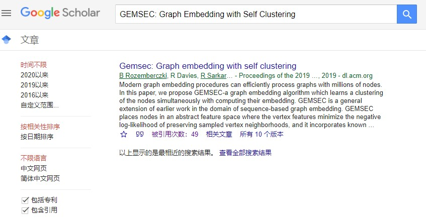
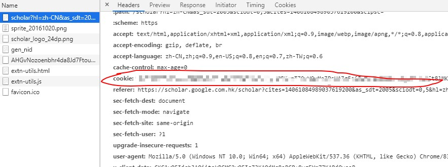

# 论文信息爬虫 Paper Information Spider
## 主要功能
此爬虫从Google Scholar和dblp上爬取论文信息，主要包括：
1. 论文作者
2. 论文年份
3. 论文会议或期刊及其页数
4. 引用数量
5. 他引数量
6. GB/T 7714/MLA/APA 引用格式

爬取结束会生成CSV以供后续查看使用
##使用
注意需要科学上网才可使用！

使用前请替换Spider.py中的headers中的cookie为合法的Google scholar的cookie，获取合法cookie的方法见下文。
```python
from spider import PaperSpider
paper_title_list = ['paper_title1','paper_title2']
spider = PaperSpider(paper_title_list,need_other_cited=True,need_cite_format=True)
spider.run()
```
其中paper_title_list是所有需要爬取的论文title，need_other_cited表示是否需要统计他引，
这个在引用数量较多时比较耗时，need_cite_format表示是否需要爬取引用格式如APA。
## cookie获取方法
打开chrome进入Google Scholar，随便搜索一篇论文



点击其中的被引用次数，进入新的页面后打开开发者工具，选择network标签，刷新页面，点击其中第一个请求
，在request headers中找到cookie复制过来即可

